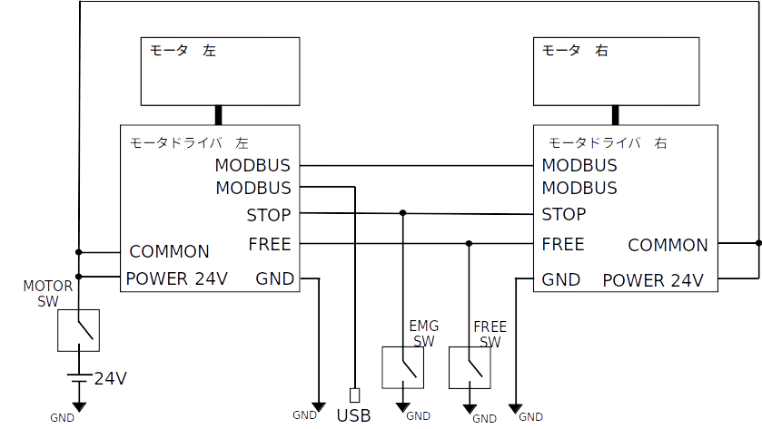

# blvr_ros2_samples

This packages are ROS2 packages for differential drive robots with Oriental Motor's BLV-R.

## Hardware Configuration

This package works with a typical differential drive robot hardware configuration.

Below is a schematic of the wiring to the motor driver.

## Package Configuration

This repository has below 4 packages.

- blvr_diffbot_description

  This shows sample robot URDF.

- blvr_diffbot_hardware

  This communicates to BLV-R with ros2_control.

- blvr_diffbot_sim

  This shows sample robot simulation.

- blvr_diffbot_bringup

  This include launch file to bring up real robot.